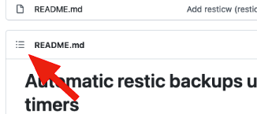
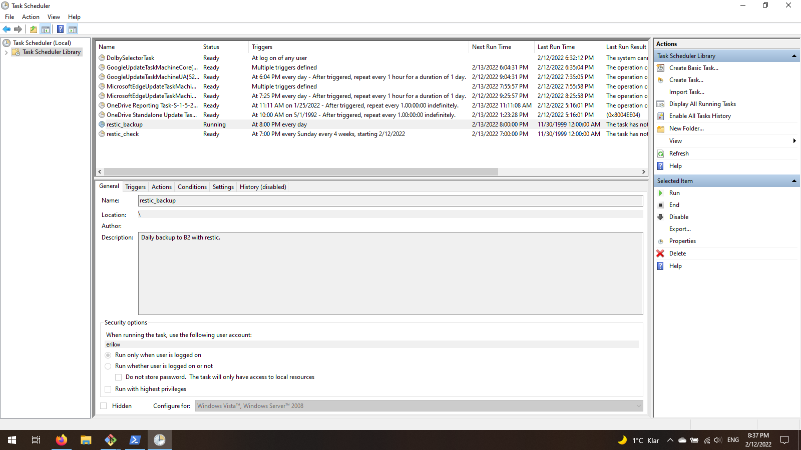
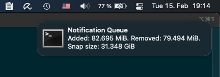

# Automatic restic Backups using Native OS Task Schedulers
*formerly named restic-systemd-automatic-backup*

[](#)
[](#)
<br>
[](https://github.com/erikw/restic-automatic-backup-scheduler/actions/workflows/linter.yml)
[](https://github.com/erikw/restic-automatic-backup-scheduler/tags)
[](https://aur.archlinux.org/packages/restic-automatic-backup-scheduler/)
[](https://aur.archlinux.org/packages/restic-automatic-backup-scheduler/)
[](https://github.com/erikw/homebrew-tap)
[](https://github.com/erikw/restic-automatic-backup-scheduler/issues)
[](https://github.com/erikw/restic-automatic-backup-scheduler/issues?q=is%3Aissue+is%3Aclosed)
[](https://github.com/erikw/restic-automatic-backup-scheduler/pulls?q=is%3Apr+is%3Aclosed)
[](LICENSE)
[](https://github.com/Netflix/osstracker)
[](#)
[](#)
<br>

[](https://github.com/erikw/restic-automatic-backup-scheduler/graphs/contributors) including these top contributors:
<a href = "https://github.com/erikw/restic-automatic-backup-scheduler/graphs/contributors">

</a>

# Intro
[restic](https://restic.net/) is a command-line tool for making backups, the right way. Check the official website for a feature explanation. As a storage backend, I recommend [Backblaze B2](https://www.backblaze.com/b2/cloud-storage.html) as restic works well with it, and it is (at the time of writing) very affordable for the hobbyist hacker! (anecdotal: I pay for my full-systems backups each month typically < 1 USD).

Unfortunately restic does not come pre-configured with a way to run automated backups, say every day. However, it's possible to set this up yourself using built-in tools in your OS and some wrappers. For Linux with systemd, it's convenient to use systemd timers. For macOS systems, we can use built-in LaunchAgents. For Windows we can use ScheduledTasks. Any OS having something cron-like will also work!

Here follows a step-by step tutorial on how to set it up, with my sample script and configurations that you can modify to suit your needs.

Note, you can use any restic's supported [storage backends](https://restic.readthedocs.io/en/latest/030_preparing_a_new_repo.html). The setup should be similar, but you will have to use other configuration variables to match your backend of choice.

## Project Scope
**Update:** this project is feature complete (see reasoning below). Only bug fixes wull be accepted. Feel free to fork if you want to add more features; forking vase was the initial scope of this project!

The scope for this is not to be a full-fledged super solution that solves all the problems and all possible setups. The aim is to be a hackable code base for you to start sewing up the perfect backup solution that fits your requirements!

Nevertheless, the project should work out of the box, be minimal but still open the doors for configuration and extensions by users.

To use a different storage backend than B2, you should only need to tweak a few settings variables in the backup profile as well as some restic arguments inside `restic_backup.sh`.

## Notes
* Tip: Navigate this document easily from the Section icon in the top left corner.
   
* ☝ **Note**: in the command listing in this document, `$` means a user shell and `#` means a root shell (or use `sudo`).


# Requirements
* `restic >=v0.9.6`
* `bash >=v4.0.0`
* (recommended)  GNU `make` if you want an automated install
  * Arch: part of the `base-devel` meta package, Debian/Ubuntu: part of the `build-essential` meta package, macOS: use the pre-installed or a more recent with Homebrew


# Setup
Depending on your system, the setup will look different. Choose one of:
*  [Linux + Systemd](#setup-linux-systemd)
*  [macOS + LaunchAgent](#setup-macos-launchagent)
*  [Windows + ScheduledTask](#setup-windows-scheduledtask)
*  [Cron](#setup-cron) - for any system having a cron daemon. Tested on FreeBSD and macOS.


## Setup Linux Systemd


☝ **Note** The Linux setup here will assume an installation to `/`.

Many Linux distributions nowadays use [Systemd](https://en.wikipedia.org/wiki/Systemd), which features good support for running services and scheduled jobs. If your distribution is no on Systemd, check out the [cron setup](#setup-cron) instead.

**TL;DR setup**
1. [Create](#1-create-backblaze-b2-account-bucket-and-keys) B2 bucket + credentials
1. Install scripts, configs systemd units/timers:
   * With `make`:
   ```console
   $ sudo make install-systemd
   ```
   *  Arch Linux users: use the [AUR](https://aur.archlinux.org/packages/restic-automatic-backup-scheduler) package, e.g.
   ```console
   $ yay -S restic-automatic-backup-scheduler
   ```
1. Fill out [configuration values](#2-configure-b2-credentials-locally) in `/etc/restic`.
1. [Initialize](#3-initialize-remote-repo) the remote repo.
	Source the profile to make all needed configuration available to `restic(1)`. All commands after this assumes the profile is sourced in the current shell.
   ```console
	# source /etc/restic/default.env.sh
	# restic init
   ```
1. Configure [how often](https://www.freedesktop.org/software/systemd/man/systemd.time.html#Calendar%20Events) backups should be done.
   * If needed, edit `OnCalendar` in `/usr/lib/systemd/system/restic-backup@.timer`.
1. Enable automated backup for starting with the system & make the first backup:
   ```console
   # systemctl enable --now restic-backup@default.timer
   ```
1. Watch the first backup progress with Systemd journal:
   ```console
   # journalctl -f --lines=50 -u restic-backup@default
   ```
1. Verify the backup
   ```console
   # restic snapshots
   ```
1. (recommended) Enable the check job that verifies that the backups for the profile are all intact.
   ```console
   # systemctl enable --now restic-check@default.timer
   ````
1. (optional) Define multiple profiles: just make a copy of the `default.env.sh` and use the defined profile name in place of `default` to run backups or enable timers. Notice that the value after `@` works as a parameter.
   ```console
   # systemctl enable restic-backup@other_profile.timer
   ```
1. Consider more [optional features](#optional-features).


## Setup macOS LaunchAgent


☝ **Note** The macOS setup here will assume a Homebrew installation to the [recommended default location](https://docs.brew.sh/FAQ#why-should-i-install-homebrew-in-the-default-location). This is [`$HOMEBREW_PREFIX` (`brew --prefix`)](https://docs.brew.sh/Formula-Cookbook#variables-for-directory-locations) , which is `/usr/local` on Intel Macs and `/opt/homebrew` on [Apple Silicon](https://docs.brew.sh/FAQ#why-is-the-default-installation-prefix-opthomebrew-on-apple-silicon).

[Launchd](https://www.launchd.info/) is the modern built-in service scheduler in macOS. It has support for running services as root (Daemon) or as a normal user (Agent). Here we set up a LaunchAgent to be run as your normal user for starting regular backups.

**TL;DR setup**
1. [Create](#1-create-backblaze-b2-account-bucket-and-keys) B2 bucket + credentials
1. Install scripts, configs and LaunchAgent:
   * (recommended) with Homebrew from the [erikw/homebrew-tap](https://github.com/erikw/homebrew-tap):
   ```console
	$ brew install erikw/tap/restic-automatic-backup-scheduler
   ```
   * Using `make`:
   ```console
	$ make PREFIX=$(brew --prefix) install-launchagent
   ```
1. Fill out [configuration values](#2-configure-b2-credentials-locally) in `$(brew --prefix)/etc/restic`.
1. [Initialize](#3-initialize-remote-repo) the remote repo.
	Source the profile to make all needed configuration available to `restic(1)`. All commands after this assumes the profile is sourced in the current shell.
   ```console
	$ source $(brew --prefix)/etc/restic/default.env.sh
	$ restic init
   ```
1. Configure [how often](https://developer.apple.com/library/archive/documentation/MacOSX/Conceptual/BPSystemStartup/Chapters/ScheduledJobs.html#//apple_ref/doc/uid/10000172i-CH1-SW1) backups should be done. If needed, edit `OnCalendar` in
   * Homebrew install: `~/Library/LaunchAgents/homebrew.mxcl.restic-automatic-backup-scheduler.plist`.
   * `make` install: `~/Library/LaunchAgents/com.github.erikw.restic-backup.plist`.
1. Enable automated backup for starting with the system & make the first backup:
   * Homebrew install:
    ```console
	$ brew services start restic-automatic-backup-scheduler
	```
   * `make` install:
    ```console
	$ launchctl bootstrap gui/$UID ~/Library/LaunchAgents/com.github.erikw.restic-backup.plist
	$ launchctl enable gui/$UID/com.github.erikw.restic-backup
	$ launchctl kickstart -p gui/$UID/com.github.erikw.restic-backup
	```
	As a convenience, a shortcut for the above commands are `$ make activate-launchagent-backup`.
1. Watch the first backup progress from the log files:
   ```console
   $ tail -f ~/Library/Logs/restic/backup*
   ```
1. Verify the backup
   ```console
   $ restic snapshots
   ```
1. (recommended) Enable the check job that verifies that the backups for the profile are all intact.
   * Homebrew install:
    ```console
	$ brew services start restic-automatic-backup-scheduler-check
	```
   * `make` install:
    ```console
	$ launchctl bootstrap gui/$UID ~/Library/LaunchAgents/com.github.erikw.restic-check.plist
	$ launchctl enable gui/$UID/com.github.erikw.restic-check
	$ launchctl kickstart -p gui/$UID/com.github.erikw.restic-check
	```
	As a convenience, a shortcut for the above commands are `$ make activate-launchagent-check`.
1. Consider more [optional features](#optional-features).

### Homebrew Setup Notes
Then control the service with homebrew:
```console
$ brew services start restic-automatic-backup-scheduler
$ brew services restart restic-automatic-backup-scheduler
$ brew services stop restic-automatic-backup-scheduler
```

If `services start` fails, it might be due to previous version installed. In that case remove the existing version and try again:
```console
$ launchctl bootout gui/$UID/com.github.erikw.restic-backup
$ brew services start restic-automatic-backup-scheduler
```

### Make Setup Notes
Use the `disable` command to temporarily pause the agent, or `bootout` to uninstall it.
```
$ launchctl disable gui/$UID/com.github.erikw.restic-backup
$ launchctl bootout gui/$UID/com.github.erikw.restic-backup
```

If you updated the `.plist` file, you need to issue the `bootout` followed by `bootrstrap` and `enable` sub-commands of `launchctl`. This will guarantee that the file is properly reloaded.


## Setup Windows ScheduledTask


Windows comes with a built-in task scheduler called [ScheduledTask](https://docs.microsoft.com/en-us/powershell/module/scheduledtasks/new-scheduledtask?view=windowsserver2022-ps). The frontend app is "Task Scheduler" (`taskschd.msc`) and we can use PowerShell commands to install a new scheduled task.

I describe here one of may ways you can get restic and this backup script working on Windows. Here I chose to work with `scoop` and `git-bash`.


**TL;DR setup**
1. Install [scoop](https://scoop.sh/)
1. Install dependencies from a PowerShell with *administrator privileges*. `pwsh` should be installed to be able to run powershell in shebang scripts.
   ```console
	powershell> scoop install restic make git pwsh
   ```
1. In a *non-privileged* PowerShell, start git-bash and clone this repo
   ```console
	powershell> git-bash
	git-bash$ mkdir ~/src && cd ~/src/
    git-bash$ git clone https://github.com/erikw/restic-automatic-backup-scheduler.git && cd $(basename "$_" .git)
   ```
1. Install scripts, configs and ScheduledTasks
   ```console
    git-bash$ make install-schedtask
   ```
1. Fill out [configuration values](#2-configure-b2-credentials-locally) in `/etc/restic`.
   ```console
    git-bash$ vim /etc/restic/*
   ```
   Note that you should use cygwin/git-bash paths. E.g. in `default.env.sh` you could have
   ```bash
	export RESTIC_BACKUP_PATHS='/c/Users/<username>/My Documents'
   ```
1. [Initialize](#3-initialize-remote-repo) the remote repo.
	Source the profile to make all needed configuration available to `restic(1)`. All commands after this assumes the profile is sourced in the current shell.
   ```console
    git-bash$ source /etc/restic/default.env.sh
    git-bash$ restic init
   ```
1. Make the first backup
   ```console
    git-bash$ restic_backup.sh
   ```
1. Verify the backup
   ```console
    git-bash$ restic snapshots
   ```
1. Inspect the installed ScheduledTasks and make a test run
   1. Open the app "Task Scheduler" (`taskschd.msc`)
   1. Go to the local "Task Scheduler Library"
   1. Right click on one of the newly installed tasks e.g. `restic_backup` and click "run".
      - If the tasks are not there, maybe you opended it up before `make install-schedtask`: just close and start it again to refresh.
   1. Now a git-bash window should open running `restic_backup.sh`, and the next time the configured schedule hits!
1. Consider more [optional features](#optional-features).


With `taskschd.msc` you can easily start, stop, delete and configure the scheduled tasks to your liking:
<a href="img/tasksched.png" title="Windows Task Scheduler"></a>


## Setup Cron


☝ **Note** There are many different cron [implementations](https://wiki.archlinux.org/title/Cron) out there and they all work slightly different.

Any system that has a cron-like system can easily setup restic backups as well. However if you system supports any of the previous setups, those are recommended over cron as they provide more features and reliability for your backups.


**TL;DR setup**
1. [Create](#1-create-backblaze-b2-account-bucket-and-keys) B2 bucket + credentials
1. Install scripts, configs systemd units/timers:
   ```console
   $ sudo make install-cron
   ```
   * This assumes that your cron supports dropping files into `/etc/cron.d/`. If that is not the case, simply copy the relevant contents of the installed `/etc/cron.d/restic` in to your `/etc/crontab`.
   ```console
   # grep "^@.*restic_" /etc/cron.d/restic >> /etc/crontab
   ```
1. Fill out [configuration values](#2-configure-b2-credentials-locally) in `/etc/restic`.
1. [Initialize](#3-initialize-remote-repo) the remote repo.
	Source the profile to make all needed configuration available to `restic(1)`. All commands after this assumes the profile is sourced in the current shell.
   ```console
	# source /etc/restic/default.env.sh
	# restic init
   ```
1. Make the first backup
   ```console
    # restic_backup.sh
   ```
1. Verify the backup
   ```console
   # restic snapshots
   ```
1. Configure [how often](https://crontab.guru/) backups should be done by directly editing `/etc/cron.d/restic` (or `/etc/crontab`).
1. Consider more [optional features](#optional-features).


## Detailed Manual Setup


This is a more detailed explanation than the TL;DR sections above that will give you more understanding in the setup. This section is more general, but uses Linux + Systemd as the example setup.

#### 0. Clone Repo
```console
$ git clone https://github.com/erikw/restic-automatic-backup-scheduler.git && cd $(basename "$_" .git)
````

Make a quick search-and-replace in the source files:
```console
$ find bin etc usr Library ScheduledTask -type f -exec sed -i.bak -e 's|{{ INSTALL_PREFIX }}||g' {} \; -exec rm {}.bak \;
```
and you should now see that all files have been changed like e.g.
```diff
-export RESTIC_PASSWORD_FILE="{{ INSTALL_PREFIX }}/etc/restic/pw.txt"
+export RESTIC_PASSWORD_FILE="/etc/restic/pw.txt"
```

Why? The OS specific TL;DR setups above all use the [Makefile](Makefile) or a package manager to install these files. The placeholder string `{{ INSTALL_PREFIX }}` is in the source files for portability reasons, so that the Makefile can support all different operating systems. `make` users can set a different `$PREFIX` when installing like `PREFIX=/usr/local make install-systemd`.

In this detailed manual setup we will copy all files manually to `/etc`and `/bin`. Thus, we need to remove the placeholder string `{{ INSTALL_PREFIX }}` in the source files as a first step.


#### 1. Create Backblaze B2 Account, Bucket and Keys
In short:
1. Create a [Backblaze](https://www.backblaze.com/) account (use 2FA!).
1. Create a new [B2 bucket](https://secure.backblaze.com/b2_buckets.htm).
   * Private, without B2 encryption and without the object lock feature
1. Create a pair of [keyId and applicationKey](https://secure.backblaze.com/app_keys.htm?bznetid=17953438771644852981527)
   * Limit scope of the new id and key pair to only the above created bucket.

First, see this official Backblaze [tutorial](https://help.backblaze.com/hc/en-us/articles/4403944998811-Quickstart-Guide-for-Restic-and-Backblaze-B2-Cloud-Storage) on restic, and follow the instructions ("Create Backblaze account with B2 enabled") there on how to create a new B2 bucket. In general, you'd want a private bucket, without B2 encryption (restic does the encryption client side for us) and without the object lock feature.

For restic to be able to connect to your bucket, you want to in the B2 settings create a pair of keyID and applicationKey. It's a good idea to create a separate pair of ID and Key with for each bucket that you will use, with limited read&write access to only that bucket.


#### 2. Configure B2 Credentials Locally
Put these files in `/etc/restic/`:
* `_global.env.sh`: Fill this file out with your global settings including B2 keyID & applicationKey.
* `default.env.sh`: This is the default profile. Fill this out with bucket name, backup paths and retention policy. This file sources `_global.env.sh` and is thus self-contained and can be sourced in the shell when you want to issue some manual restic commands. For example:
   ```console
   $ source /etc/restic/default.env.sh
   $ restic snapshots    # You don't have to supply all parameters like --repo, as they are now in your environment!
   ````
* `pw.txt`: This file should contain the restic password (single line) used to encrypt the repository. This is a new password what soon will be used when initializing the new repository. It should be unique to this restic backup repository and is needed for restoring from it. Don't re-use your B2 login password, this should be different. For example you can generate a 128 character password (must all be on one line) with:
   ```console
   $ openssl rand -base64 128 | tr -d '\n' > /etc/restic/pw.txt
   ```
* `backup_exclude.txt`: List of file patterns to ignore. This will trim down your backup size and the speed of the backup a lot when done properly!

#### 3. Initialize remote repo
Now we must initialize the repository on the remote end:
```console
$ sudo -i
# source /etc/restic/default.env.sh
# restic init
```

#### 4. Script for doing the backup
Put this file in `/bin`:
* `restic_backup.sh`: A script that defines how to run the backup. The intention is that you should not need to edit this script yourself, but be able to control everything from the `*.env.sh` profiles.

Restic support exclude files. They list file pattern paths to exclude from you backups, files that just occupy storage space, backup-time, network and money. `restic_backup.sh` allows for a few different exclude files.
* `/etc/restic/backup_exclude.txt` - global exclude list. You can use only this one if your setup is easy. This is set in `_global.env.sh`. If you need a different file for another profile, you can override the envvar `RESTIC_BACKUP_EXCLUDE_FILE` in this profile.
* `.backup_exclude.txt` per backup path. If you have e.g. an USB disk mounted at /mnt/media and this path is included in the `$RESTIC_BACKUP_PATHS`, you can place a file `/mnt/media/.backup_exclude.txt` and it will automatically picked up. The nice thing about this is that the backup paths are self-contained in terms of what they shoud exclude!

#### 5. Make first backup
Now see if the backup itself works, by running as root

```console
# source /etc/restic/default.env.sh
# /bin/restic_backup.sh
````

#### 6. Verify the backup
As the `default.env.sh` is already sourced in your root shell, you can now just list the snapshost
```console
# restic snapshots
```

Alternatively you can mount the restic snapshots to a directory set `/mnt/restic`
```console
# restic mount /mnt/restic
# ls /mnt/restic
```

#### 7. Backup automatically
All OS setups differs in what task scheduler they use. As a demonstration, let's look at how we can do this with systemd under Linux here.

Put these files in `/etc/systemd/system` (note that the Makefile installs as package to `/usr/lib/systemd/system`)
* `restic-backup@.service`: A service that calls the backup script with the specified profile. The profile is specified
  by the value after `@` when running it (see below).
* `restic-backup@.timer`: A timer that starts the former backup every day (same thing about profile here).
   * If needed, edit this file to configure [how often](https://www.freedesktop.org/software/systemd/man/systemd.time.html#Calendar%20Events) back up should be made. See the `OnCalendar` key in the file.

Now simply enable the timer with:
```console
# systemctl enable --now restic-backup@default.timer
````

You can see when your next backup is scheduled to run with
```console
# systemctl list-timers | grep restic
```

and see the status of a currently running backup with:
```console
# systemctl status restic-backup
```

or start a backup manually:
```console
$ systemctl start restic-backup@default
```

You can follow the backup stdout output live as backup is running with:
```console
$ journalctl -f -u restic-backup@default.service
````
(skip `-f` to see all backups that has run)


#### Recommended: Automated Backup Checks
Once in a while it can be good to do a health check of the remote repository, to make sure it's not getting corrupt. This can be done with `$ restic check`.

There is companion scripts, service and timer (`*check*`) to restic-backup.sh that checks the restic backup for errors; look in the repo in `usr/lib/systemd/system/` and `bin/` and copy what you need over to their corresponding locations.

```console
# systemctl enable --now restic-check@default.timer
````


## Optional Features


### Optional: Multiple profiles
To have different backup jobs having e.g. different buckets, backup path of schedule,  just make a copy of the `default.env.sh` and use the defined profile name in place of `default` in the previous steps.

To create a different backup and use you can do:
```console
# cp /etc/restic/default.env.sh /etc/restic/other.env.sh
# vim /etc/restic/other.env.sh  # Set backup path, bucket etc.
# source /etc/restic/other.env.sh
# restic_backup.sh
```

### Optional: Summary stats log

When enabled, it will write to a CSV log file the stats after each backup. Can be enabled by uncommenting its env variable (`RESTIC_BACKUP_STATS_DIR`) on the global environment file or defining it on a specific profile.

The stats log (as well as) the desktop notifications incur in an additional run of `restic snapshots` and `restic diff`. This execution is shared with the notifications (no extra run).

### Optional: Desktop Notifications


It's a good idea to be on top of your backups to make sure that they don't increase a lot in size and incur high costs. However, it's notoriously tricky to make GUI notifications correctly from a non-user process (e.g. root).

Therefore, this project provides a lightweight solution for desktop notifications that works like this: Basically `restic_backup.sh` will append a summary line of the last backup to a user-owned file (the user running your OS's desktop environment) in a fire-and-forget fashion. Then the user has a process that reads this and forward each line as a new message to the desktop environment in use.

To set desktop notifications up:
1. Create a special FIFO file as your desktop user:
	```console
	$ mkfifo /home/user/.cache/notification-queue
	```
1. In your profile, e.g. `/etc/restic/default.sh`, set:
	```bash
	RESTIC_BACKUP_NOTIFICATION_FILE=/home/user/.cache/notification-queue
	```
1. Create a listener on the notification queue file that forwards to desktop notifications
   * Linux auto start + cross-platform notifier / notify-send
      * [notification-queue-notifier](https://github.com/gerardbosch/dotfiles/blob/2130d54daa827e7f885abac0d4f10b6f67d28ad3/home/bin/notification-queue-notifier)
      * [notification-queue.desktop](https://github.com/gerardbosch/dotfiles-linux/blob/ea0f75bfd7a356945544ecaa42a2fc35c9fab3a1/home/.config/autostart/notification-queue.desktop)
   * macOS auto start + [terminal-notifier](https://github.com/julienXX/terminal-notifier)
      * [notification-queue-notifier.sh](https://github.com/erikw/dotfiles/blob/8a942defe268292200b614951cdf433ddccf7170/bin/notification-queue-notifier.sh)
      * [com.user.notificationqueue.plist](https://github.com/erikw/dotfiles/blob/8a942defe268292200b614951cdf433ddccf7170/.config/LaunchAgents/com.user.notificationqueue.plist)


### Optional: Email Notification on Failure
#### Systemd
We want to be aware when the automatic backup fails, so we can fix it. Since my laptop does not run a mail server, I went for a solution to set up my laptop to be able to send emails with [postfix via my Gmail](https://easyengine.io/tutorials/linux/ubuntu-postfix-gmail-smtp/). Follow the instructions over there.

Put this file in `/bin`:
* `systemd-email`: Sends email using sendmail(1). This script also features time-out for not spamming Gmail servers and getting my account blocked.

Put this file in `/etc/systemd/system/`:
* `status-email-user@.service`: A service that can notify you via email when a systemd service fails. Edit the target email address in this file, and replace or remove `{{ INSTALL_PREFIX }}` according to your installation.

Now edit `/usr/lib/systemd/system/restic-backup@.service` and `/usr/lib/systemd/system/restic-check@.service` to call this service failure.
```
OnFailure=status-email-user@%n.service
```
#### Cron
Use `bin/cron_mail`: A wrapper for running cron jobs, that sends output of the job as an email using the mail(1) command. This assumes that the `mail` program is correctly setup on the system to send emails.

To use this, wrap the restic script command with it in your cron file like:
```diff
-@midnight	root	. /etc/restic/default.sh && restic_backup.sh
+@midnight	root	. /etc/restic/default.sh && cron_mail restic_backup.sh
```


### Optional: No Backup on Metered Connections (Linux/systemd only)
For a laptop, it can make sense to not do heavy backups when your on a metered connection like a shared connection from you mobile phone. To solve this we can set up a systemd service that is in success state only when a connection is unmetered. Then we can tell our backup service to depend on this service simply! When the unmetered service detects an unmetered connection it will go to failed state. Then our backup service will not run as it requires this other service to be in success state.

1. Edit `restic-backup@.service` and `restic-check@.service` to require the new service to be in success state:
   ```
   Requires=nm-unmetered-connection.service
   After=nm-unmetered-connection.service
   ```
1. Copy and paste the command below, it will install the following files and refresh systemd daemon:
1. Put this file in `/etc/systemd/system/`:
   * `nm-unmetered-connection.service`: A service that is in success state only if the connection is unmetered.
1. Install this file in `/bin`:
   * `nm-unmetered-connection.sh`: Detects metered connections and returns an error code if one is detected. This scripts requires the Gnome [NetworkManager](https://wiki.gnome.org/Projects/NetworkManager) to be installed (modify this script if your system has a different network manager).
1. Reload systemd with
	```console
	# systemctl daemon-reload
	```

☝ **Tip**: All steps but the first can be done in one go if you use the Makefile. Set `$PREFIX` as needed or leave empty for install to `/`.
```bash
sudo bash -c 'export PREFIX=
 make build/usr/lib/systemd/system/nm-unmetered-connection.service
 install -m 0644 build/usr/lib/systemd/system/nm-unmetered-connection.service $PREFIX/etc/systemd/system
 install -m 0555 bin/nm-unmetered-connection.sh /bin
 systemctl daemon-reload
'
```

### Optional: Restic Wrapper Script
For convenience there's a `restic` wrapper script that makes loading profiles and **running restic**
straightforward (it needs to run with sudo to read environment). Just run:

* `sudo resticw WHATEVER` (e.g. `sudo resticw snapshots`) to use the default profile.
* You can run the wrapper by passing a specific profile: `resticw -p anotherprofile snapshots`.
* The wrapper has extras on top of `restic` like `--diff-latest` option.

Useful commands:
| Command                                           | Description                                                                           |
|---------------------------------------------------|---------------------------------------------------------------------------------------|
| `resticw snapshots`                               | List backup snapshots                                                                 |
| `resticw diff <snapshotId-1> <snapshotId-2>`      | Show the changes between backup snapshots                                             |
| `resticw stats` / `resticw stats snapshotId ...`  | Show the statistics for the whole repo or the specified snapshots                     |
| `resticw mount /mnt/restic`                       | Mount your remote repository                                                          |
| `resticw --diff-latest`                           | Show latest snapshot changes: Runs `restic diff` after finding the latest 2 snapshots |


# Uninstall
There is a make target to remove all files (scripts and **configs)** that were installed by `sudo make install-*`. Just run:

```console
$ sudo make uninstall
```


# Debugging
The best way to debug what's going on is to run the `restic_backup.sh` script with bash's trace function. You can activate it by running the script with `bash -x`:

```consle
$ source /etc/restic/default.env.sh
$ bash -x /bin/restic_backup.sh
```

To debug smaller portions of the backup script, insert these lines at the top and bottom of the relevant code portions e.g.:

```bash
set -x
exec 2>/tmp/restic-automatic-backup-scheduler.log
<code to debug>
set +x
```

and then inspect the outputs like

```shell
$ less /tmp/restic-automatic-backup-scheduler.log
$ tail -f /tmp/restic-automatic-backup-scheduler.log # or follow output like this.
```


# Development
* To not mess up your real installation when changing the `Makefile` simply install to a `$PREFIX` like
   ```console
   $ PREFIX=/tmp/restic-test make install-systemd
   ```
* **Updating the `resticw` parser:** If you ever update the usage `DOC`, you will need to refresh the auto-generated parser:
  ```console
  $ pip install doctopt.sh
  $ doctopt.sh usr/local/bin/resticw
  ```

# Releasing
To make a new release:
1. Create a new tag:
   ```console
   $ vi CHANGELOG.md && git commit -am "Update CHANGELOG.md"
   $ git tag vX.Y.Z
   $ git push && git push --tags
   ```
1. Update version in the AUR [PKGBUILD](https://aur.archlinux.org/packages/restic-automatic-backup-scheduler/)
1. Update version in the Homebrew Formulas (see the repo README):
   * [restic-automatic-backup-scheduler](https://github.com/erikw/homebrew-tap/blob/main/Formula/restic-automatic-backup-scheduler.rb)
   * [restic-automatic-backup-scheduler-check](https://github.com/erikw/homebrew-tap/blob/main/Formula/restic-automatic-backup-scheduler-check.rb)
